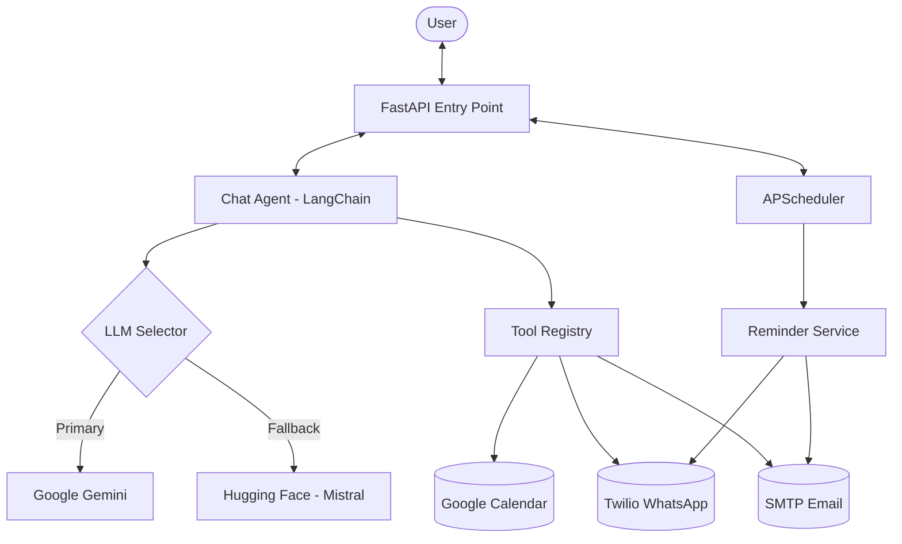

# 🤖 AI Personal Assistant (Production-Grade)


## 🌍 Live Demo

- 🚀 [Live API](https://ai-personal-assistant-3xni.onrender.com)
- 📘 [API Docs](https://ai-personal-assistant-3xni.onrender.com/docs)
- 🩺 [Health Check](https://ai-personal-assistant-3xni.onrender.com/health)

A highly capable GenAI Personal Assistant designed for production environments. Built with **LangChain**, **FastAPI**, and **APScheduler**, this agent understands natural language commands to manage your calendar, send notifications, and handle emails with enterprise-grade resilience.

## 🚀 Key Features

- **🧠 Multi-Brain Architecture**: Primary logic powered by Google Gemini with a robust fallback system using Hugging Face (Mistral-7B).
- **📅 Smart Calendar Management**: Deep integration with Google Calendar API for scheduling and event synchronization.
- **🔔 Resilient Reminders**: Multi-channel notifications via WhatsApp (Twilio) and Email with built-in retry logic.
- **🕒 Timezone-Aware**: Native support for `Asia/Kolkata` ensuring your schedule is always accurate.
- **🛠 Tool-First Agent**: Autonomous execution of tasks like email sending, meeting listing, and cleanup jobs.
- **🐳 Deployment Ready**: Fully containerized with Docker and cloud-compatible configuration (Railway/Render).

## 🧠 Architecture



## 🛠 Tech Stack

- **Backend**: Python 3.11, FastAPI, Uvicorn
- **AI/LLM**: LangChain, Google Generative AI, Hugging Face Inference
- **Automation**: APScheduler (Background Jobs)
- **Integrations**: Google Calendar API (OAuth), Twilio API, SMTP
- **Infrastructure**: Docker, Procfile, Pydantic (Config)

## 📌 Production Enhancements

- **Centralized Config**: A single source of truth for all secrets and settings in `app/config.py`.
- **Cloud-Safe Auth**: Support for environment-based Google credentials (JSON strings).
- **Graceful Shutdown**: Lifecycle management for the background scheduler.
- **Structured Logging**: Comprehensive tracking of agent actions and service health.

## 📦 Project Structure

```text
ai-personal-assistant/
├── app/                      # Core application package
│   ├── agent/                # AI logic & tool registry
│   ├── api/                  # FastAPI routes & schemas
│   ├── services/             # Twilio, GCal, Email services
│   ├── config.py             # Cloud-ready configuration
│   └── main.py               # Unified entry point
├── tests/                    # Comprehensive test suite
├── scripts/                  # Development & debug utilities
├── frontend/                 # Web dashboard components
├── Dockerfile                # Production container spec
└── Procfile                  # Cloud platform instructions
```

## ⚙️ Deployment

### Environment Variables
Required keys for your `.env` or Cloud Provider:
```env
GOOGLE_API_KEY=...
HUGGINGFACE_API_TOKEN=...
TWILIO_ACCOUNT_SID=...
TWILIO_AUTH_TOKEN=...
EMAIL_ADDRESS=...
EMAIL_PASSWORD=...
GOOGLE_CREDENTIALS_JSON=... # JSON string of your service account
```

### Running Locally
```bash
# Install dependencies
pip install -r requirements.txt

# Start Unified Server
python -m app.main
```

### Docker
```bash
docker build -t ai-agent .
docker run -p 8000:8000 --env-file .env ai-agent
```

## 🔒 Security
- All credentials are managed via environment variables.
- Sensitive files like `token.pickle` and `calendar.json` are strictly excluded via `.gitignore`.

## 📈 Future Roadmap
- [ ] Voice interface integration.
- [ ] Multi-tenant support for different executives.
- [ ] Slack/Teams integration.

---
**Maintained by [Mahadev J](https://github.com/MahadevJagtap)**
